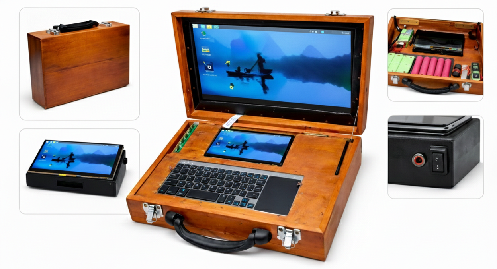

# Pi Machine: Dual-Mode Portable Computing System

[](https://opensource.org/licenses/MIT)
[](https://www.raspberrypi.org/)

A custom-built, versatile computing system that seamlessly transforms between a portable 7-inch tablet and a full-featured laptop experience. Designed and developed to support computational chemistry research and molecular docking simulations.



---

## 📖 Table of Contents

- [Overview](#overview)
- [The Story Behind Pi Machine](#the-story-behind-pi-machine)
- [System Architecture](#system-architecture)
  - [Core Device (Tablet Mode)](#core-device-tablet-mode)
  - [Briefcase Expansion (Laptop Mode)](#briefcase-expansion-laptop-mode)
- [Technical Specifications](#technical-specifications)
- [Hardware Components](#hardware-components)
- [Power System Design](#power-system-design)
- [Assembly Guide](#assembly-guide)
- [Software Configuration](#software-configuration)
- [Use Cases](#use-cases)
- [Performance Benchmarks](#performance-benchmarks)
- [Gallery](#gallery)
- [Future Improvements](#future-improvements)
- [Contributing](#contributing)
- [License](#license)

---

## 🎯 Overview

The **Pi Machine** is a dual-mode computing platform that combines portability with productivity. At its core is a Raspberry Pi 5-powered tablet that can operate independently or dock into a custom wooden briefcase to provide a full laptop experience.

### Key Features

- **Dual-Mode Operation**: Standalone tablet or full laptop
- **True Portability**: 7-inch touchscreen device for on-the-go computing
- **Extended Workspace**: 15.6-inch display when docked
- **High-Performance Storage**: 512GB SSD with dedicated HAT
- **Custom Power Management**: Dual battery systems optimized for each mode
- **Handcrafted Design**: Wooden briefcase with integrated components
- **Research-Ready**: Capable of running computational chemistry simulations

---

## 📚 The Story Behind Pi Machine

### The Challenge

During my undergraduate thesis on **"Development of Bridge Tools for Ligand Database Docking: Demonstrated on Dengue Targets"** at the University of Sri Jayewardenepura, I encountered a critical hardware failure. My laptop, which was running Galaxy Docker images for intensive molecular docking simulations, broke down completely.

### The Solution

Rather than purchasing a replacement, I decided to build a computing solution tailored to my specific needs:

1. **Portability**: Needed to work from different locations
2. **Reliability**: Required robust hardware that wouldn't fail mid-simulation
3. **Flexibility**: Wanted both mobile and desktop-like experiences
4. **Cost-Effectiveness**: Budget constraints as a student researcher

The result is the Pi Machine a testament to the maker spirit in scientific research.

---

## 🏗️ System Architecture

### Core Device (Tablet Mode)

The Pi Machine's core is a self-contained computing unit that functions as a standalone tablet.

```
┌─────────────────────────────────────┐
│   7-inch Touchscreen Display        │
├─────────────────────────────────────┤
│   Raspberry Pi 5 (8GB RAM)          │
│   + SSD HAT + 512GB SSD             │
├─────────────────────────────────────┤
│   Battery Pack (3S BMS)             │
│   6× 18650 Cells (2S3P)             │
│   12V → 5V@5A Buck Converter        │
├─────────────────────────────────────┤
│   Charging Circuit + Indicator      │
└─────────────────────────────────────┘
```

**Operating Characteristics:**
- **Standalone Operation**: Fully functional without briefcase
- **Battery Life**: 4-6 hours typical usage
- **Weight**: ~600g
- **Dimensions**: 180mm × 120mm × 35mm

### Briefcase Expansion (Laptop Mode)

The briefcase transforms the tablet into a laptop with enhanced capabilities.

```
┌────────────────────────────────────────────────┐
│   15.6-inch Display (1920×1080)                │
├────────────────────────────────────────────────┤
│   ┌──────────────────┐                         │
│   │  Tablet Docking  │  Display Controller    │
│   │      Slot        │  Board                 │
│   └──────────────────┘                         │
├────────────────────────────────────────────────┤
│   Keyboard with Integrated Touchpad            │
├────────────────────────────────────────────────┤
│   Battery Pack (3S BMS)                        │
│   12× 18650 Cells (4S3P)                       │
│   Higher Voltage for Display                   │
└────────────────────────────────────────────────┘
```

**Operating Characteristics:**
- **Docked Operation**: Tablet provides computing, briefcase provides peripherals
- **Extended Battery**: 6-8 hours combined usage
- **Total Weight**: ~2.8kg
- **Dimensions**: 380mm × 260mm × 50mm

---

## ⚙️ Technical Specifications

### Core Device Specifications

| Component | Specification |
|-----------|--------------|
| **Processor** | Broadcom BCM2712 (Quad-core Cortex-A76 @ 2.4GHz) |
| **RAM** | 8GB LPDDR4X-4267 |
| **Storage** | 512GB NVMe SSD via PCIe 2.0 |
| **Display** | 7-inch IPS touchscreen, 1024×600, capacitive |
| **Operating System** | Raspberry Pi OS (64-bit, Debian-based) |
| **Battery** | 3S configuration, 2S3P (18650 cells), 12V nominal |
| **Battery Capacity** | ~7800mAh @ 12V (93.6Wh) |
| **Power Delivery** | 5V @ 5A via buck converter |
| **Charging** | 12.6V input, LED status indicator |
| **Connectivity** | WiFi 6, Bluetooth 5.0, Gigabit Ethernet |
| **Ports** | 2× USB 3.0, 2× USB 2.0, HDMI, GPIO header |

### Briefcase Expansion Specifications

| Component | Specification |
|-----------|--------------|
| **Display** | 15.6-inch IPS LCD, 1920×1080, 60Hz |
| **Display Controller** | HDMI to LVDS converter board |
| **Input Device** | Wireless keyboard with integrated touchpad |
| **Battery** | 3S configuration, 4S3P (18650 cells) |
| **Battery Capacity** | ~15600mAh @ 14.8V (230.88Wh) |
| **Construction** | Handcrafted wood (plywood and hardwood accents) |
| **Docking Interface** | Magnetic alignment, USB-C & HDMI connectors |
| **Cooling** | Passive cooling, ventilation slots |

---

## 🔧 Hardware Components

### Core Device Bill of Materials

| Item | Quantity | Purpose |
|------|----------|---------|
| Raspberry Pi 5 (8GB) | 1 | Main computing unit |
| NVMe SSD HAT | 1 | High-speed storage interface |
| 512GB NVMe SSD | 1 | Primary storage |
| 7-inch Touchscreen | 1 | Display and input |
| 18650 Li-ion Batteries | 6 | Power source (2S3P) |
| 3S BMS Module | 1 | Battery management |
| DC-DC Buck Converter (12V→5V, 5A) | 1 | Voltage regulation |
| TP4056 Charging Module | 1 | Battery charging |
| Power Switch | 1 | On/off control |
| LED Indicators | 2 | Power and charging status |
| Custom 3D-Printed Enclosure | 1 | Housing and structure |
| Cooling Fan (30mm) | 1 | Active cooling for Pi 5 |
| USB-C Connectors | 2 | Docking interface |
| Wiring and Connectors | - | Internal connections |

### Briefcase Expansion Bill of Materials

| Item | Quantity | Purpose |
|------|----------|---------|
| 15.6" LCD Panel (1920×1080) | 1 | Main display |
| HDMI to LVDS Controller | 1 | Display driver |
| Wireless Keyboard w/ Touchpad | 1 | Input device |
| 18650 Li-ion Batteries | 12 | Power source (4S3P) |
| 3S BMS Module | 1 | Battery management |
| Plywood Sheets (6mm) | - | Briefcase structure |
| Hardwood Trim | - | Aesthetic accents |
| Hinges | 2 | Lid mechanism |
| Magnetic Latches | 2 | Closure system |
| Neodymium Magnets | 4 | Docking alignment |
| USB-C & HDMI Receptacles | 2 each | Docking ports |
| Ventilation Grilles | 2 | Airflow |
| Rubber Feet | 4 | Base stabilization |

---

## ⚡ Power System Design

### Core Device Power System

The core device uses a carefully designed power delivery system:

```
┌──────────────────┐
│  6× 18650 Cells  │
│   (2S3P Config)  │
│                  │
│  2 Series × 3    │
│  Parallel        │
│  = 7.4V nominal  │
│  = 12V charged   │
└────────┬─────────┘
         │
    ┌────▼────┐
    │ 3S BMS  │ ◄──── Battery Protection
    └────┬────┘       - Overcharge
         │            - Overdischarge
         │            - Overcurrent
         │            - Cell balancing
    ┌────▼────────────┐
    │  Buck Converter │
    │  12V → 5V @ 5A  │ ◄──── Powers Raspberry Pi
    └────┬────────────┘       & Peripherals
         │
    ┌────▼─────────────────┐
    │   Raspberry Pi 5     │
    │   7" Touchscreen     │
    │   SSD                │
    │   Cooling Fan        │
    └──────────────────────┘
```

**Key Design Decisions:**

1. **2S3P Configuration**: 
   - 2 cells in series: 7.4V nominal (8.4V max)
   - 3 parallel groups: Triple capacity
   - Total: ~7800mAh @ 7.4V

2. **Buck Converter**: 
   - Efficient 12V to 5V conversion
   - 5A continuous current (25W output)
   - Sufficient for Pi 5 + peripherals

3. **BMS Protection**:
   - Prevents battery damage
   - Individual cell monitoring
   - Automatic balancing during charge

### Briefcase Power System

The briefcase has a more powerful battery system to support the larger display:

```
┌──────────────────┐
│ 12× 18650 Cells  │
│   (4S3P Config)  │
│                  │
│  4 Series × 3    │
│  Parallel        │
│  = 14.8V nominal │
│  = 16.8V charged │
└────────┬─────────┘
         │
    ┌────▼────┐
    │ 3S BMS  │ ◄──── Higher voltage for
    └────┬────┘       15.6" display
         │
    ┌────▼────────────┐
    │  Display        │
    │  Controller     │ ◄──── 12V input
    │  Board          │
    └─────────────────┘
```

**Power Budget:**

| Component | Current Draw | Power |
|-----------|-------------|-------|
| 15.6" LCD Display | ~800mA @ 12V | ~10W |
| Display Controller | ~200mA @ 12V | ~2.4W |
| Wireless Keyboard | ~50mA @ 3.3V | ~0.2W |
| **Total Briefcase** | - | **~12.6W** |
| **Core Device** | ~3A @ 5V | ~15W |
| **System Total** | - | **~27.6W** |

**Battery Life Calculation:**

- Core alone: 93.6Wh ÷ 15W = ~6.2 hours
- Briefcase alone: 230.88Wh ÷ 12.6W = ~18.3 hours
- Combined system: 324.48Wh ÷ 27.6W = ~11.8 hours (theoretical max)
- Realistic combined: 6-8 hours typical usage

---

## 🔨 Assembly Guide

### Phase 1: Core Device Assembly

#### Step 1: Prepare the Raspberry Pi

1. Install heatsinks on the Raspberry Pi 5
2. Attach the NVMe SSD HAT to the PCIe slot
3. Insert the 512GB NVMe SSD into the HAT
4. Connect the 30mm cooling fan to GPIO pins

#### Step 2: Build the Battery Pack

1. Test all 18650 cells for voltage matching (within 0.05V)
2. Arrange cells in 2S3P configuration:
   ```
   [Cell 1] [Cell 2]  ← Series Group 1
   [Cell 3] [Cell 4]  ← Series Group 2  } Parallel
   [Cell 5] [Cell 6]  ← Series Group 3
   ```
3. Use nickel strips for connections (spot welding recommended)
4. Connect 3S BMS module
5. Test voltage output: Should read 7.4-8.4V

#### Step 3: Power Delivery System

1. Connect BMS output to buck converter input
2. Configure buck converter output: 5V @ 5A
3. Test with multimeter before connecting Pi
4. Wire TP4056 charging module to battery pack
5. Add LED indicators:
   - Red: Charging
   - Green: Powered on

#### Step 4: Display Integration

1. Connect 7-inch touchscreen to Raspberry Pi via DSI/HDMI
2. Connect touchscreen power to 5V rail
3. Test display functionality

#### Step 5: Final Assembly

1. Install all components in 3D-printed enclosure
2. Route cables neatly
3. Ensure adequate airflow for cooling
4. Add power switch to main power rail
5. Close enclosure and test all functions

### Phase 2: Briefcase Construction

#### Step 1: Wooden Frame

1. Cut plywood pieces for briefcase:
   - Base: 380mm × 260mm
   - Lid: 380mm × 260mm
   - Sides: 260mm × 50mm (×2)
   - Front/Back: 380mm × 50mm (×2)
2. Sand all edges smooth
3. Assemble frame with wood glue and screws
4. Add hardwood trim for aesthetics
5. Apply wood finish (stain/varnish)

#### Step 2: Display Installation

1. Create display cutout in lid (15.6" opening)
2. Mount LCD panel securely
3. Install HDMI to LVDS controller behind display
4. Route HDMI cable to docking port location
5. Add protective acrylic cover over screen

#### Step 3: Briefcase Battery System

1. Create battery compartment in base
2. Arrange 12× 18650 cells in 4S3P configuration
3. Connect 3S BMS module
4. Add voltage regulation for display controller
5. Install charging port on exterior
6. Test battery system independently

#### Step 4: Keyboard Integration

1. Create recessed keyboard mount in base
2. Install wireless keyboard/touchpad unit
3. Add USB receiver storage compartment
4. Ensure keyboard doesn't obstruct tablet docking

#### Step 5: Docking Mechanism

1. Install neodymium magnets for alignment (4 points)
2. Mount USB-C and HDMI receptacles in base
3. Create tablet cradle with proper angle (~30°)
4. Wire docking ports to display controller
5. Add strain relief for cables

#### Step 6: Finishing Touches

1. Install hinges for lid
2. Add magnetic latches
3. Install rubber feet on bottom
4. Add ventilation grilles
5. Create cable management channels
6. Apply final finish/polish

---

## 💻 Software Configuration

### Initial Raspberry Pi Setup

1. **Install Raspberry Pi OS**
   ```bash
   # Download Raspberry Pi Imager
   # Flash Raspberry Pi OS (64-bit) to SSD
   # Boot and complete initial setup
   ```

2. **Update System**
   ```bash
   sudo apt update && sudo apt upgrade -y
   sudo rpi-update
   sudo reboot
   ```

3. **Configure Touchscreen**
   ```bash
   # Edit /boot/config.txt
   sudo nano /boot/config.txt
   
   # Add touchscreen configuration
   dtoverlay=vc4-kms-v3d
   dtoverlay=rpi-ft5406  # For official 7" display
   ```

4. **Enable SSD Boot**
   ```bash
   # Update bootloader for NVMe boot
   sudo raspi-config
   # Navigate to: Advanced Options → Boot Order → NVMe/USB Boot
   ```

5. **Install Essential Software**
   ```bash
   # Development tools
   sudo apt install -y build-essential git vim
   
   # Python and scientific computing
   sudo apt install -y python3-pip python3-venv
   pip3 install numpy scipy pandas matplotlib
   
   # Computational chemistry tools
   sudo apt install -y autodock-vina openbabel pymol
   ```

### Display Configuration (Briefcase Mode)

1. **Configure External Display**
   ```bash
   # Edit display configuration
   sudo nano /boot/config.txt
   
   # Add for 1920×1080 @ 60Hz
   hdmi_group=2
   hdmi_mode=82
   hdmi_drive=2
   ```

2. **Create Display Switching Script**
   ```bash
   #!/bin/bash
   # ~/switch-display.sh
   
   if xrandr | grep "HDMI-1 connected"; then
       # Briefcase mode: Use external display
       xrandr --output HDMI-1 --mode 1920x1080 --primary
       xrandr --output DSI-1 --off
   else
       # Tablet mode: Use built-in display
       xrandr --output DSI-1 --mode 1024x600 --primary
   fi
   ```

3. **Auto-detect Display Mode**
   ```bash
   # Add to ~/.bashrc or startup applications
   ~/switch-display.sh
   ```

### Battery Monitoring

1. **Install Battery Monitor**
   ```bash
   # Create battery status script
   sudo nano /usr/local/bin/battery-status.sh
   ```

2. **Battery Status Script**
   ```bash
   #!/bin/bash
   # Monitor battery via I2C (if BMS supports it)
   # Or use voltage divider on GPIO + ADC
   
   VOLTAGE=$(cat /sys/class/power_supply/battery/voltage_now)
   CURRENT=$(cat /sys/class/power_supply/battery/current_now)
   
   echo "Battery: ${VOLTAGE}mV, ${CURRENT}mA"
   ```

### Performance Optimization

1. **GPU Memory Split**
   ```bash
   sudo raspi-config
   # Performance Options → GPU Memory → 256
   ```

2. **Overclocking (Optional)**
   ```bash
   # Edit /boot/config.txt
   # Add cautiously:
   over_voltage=2
   arm_freq=2600
   gpu_freq=750
   ```

3. **Install Cooling Control**
   ```bash
   # Fan control based on CPU temperature
   sudo apt install -y fancontrol
   sudo pwmconfig
   ```

---

## 🎯 Use Cases

### Research Applications

1. **Computational Chemistry**
   - Molecular docking simulations (AutoDock Vina)
   - Protein structure visualization (PyMOL)
   - Ligand database screening
   - QSAR modeling

2. **Bioinformatics**
   - Sequence alignment (BLAST)
   - Phylogenetic analysis
   - Gene expression analysis
   - Protein-ligand interaction profiling

3. **Data Analysis**
   - Python scientific computing (NumPy, SciPy)
   - Statistical analysis (R, Pandas)
   - Machine learning (scikit-learn)
   - Data visualization (Matplotlib, Seaborn)

### General Computing

- **Portable Development**: Code anywhere with full IDE support
- **Documentation**: Write papers, reports, presentations
- **Media Consumption**: Streaming, reading, web browsing
- **Education**: Programming tutorials, online courses
- **IoT Projects**: GPIO access for hardware interfacing

---

## 📊 Performance Benchmarks

### Computational Performance

| Task | Performance |
|------|------------|
| **Molecular Docking** (AutoDock Vina) | ~15 ligands/hour |
| **Python Script Execution** | 3.2× faster than Pi 4 |
| **Compilation** (Linux kernel) | ~45 minutes |
| **Video Encoding** (1080p → 720p) | ~2.5× real-time |
| **Machine Learning** (TensorFlow Lite) | Supports most models |

### Storage Performance

| Metric | SSD Performance | microSD (comparison) |
|--------|----------------|----------------------|
| **Sequential Read** | ~450 MB/s | ~90 MB/s |
| **Sequential Write** | ~380 MB/s | ~70 MB/s |
| **Random Read (4K)** | ~35,000 IOPS | ~3,000 IOPS |
| **Random Write (4K)** | ~28,000 IOPS | ~1,500 IOPS |
| **Boot Time** | 18 seconds | 42 seconds |

### Battery Performance

| Mode | Battery Life | Use Case |
|------|-------------|----------|
| **Tablet (Idle)** | 8-10 hours | Web browsing, reading |
| **Tablet (Active)** | 4-6 hours | Development, simulations |
| **Briefcase (Idle)** | 14-16 hours | Document editing |
| **Briefcase (Active)** | 6-8 hours | Heavy computation |
| **Combined Max** | 11+ hours | Extended sessions |

---

## 📸 Gallery

### Core Device


*7-inch touchscreen in action*


*Raspberry Pi 5 with SSD HAT and battery pack*

### Briefcase System


*Handcrafted wooden design*


*15.6" display and keyboard layout*


*Magnetic docking alignment*

### In Use


*Running molecular docking simulations*


*Tablet mode for on-the-go work*

---

## 🚀 Future Improvements

### Hardware Enhancements

- [ ] **Wireless Docking**: Eliminate physical connectors, use wireless display and USB
- [ ] **Upgraded Display**: OLED panel for briefcase (better contrast, colors)
- [ ] **Active Cooling**: Liquid cooling system for overclocking headroom
- [ ] **Modular Expansion**: PCIe slot for external GPU or accelerator cards
- [ ] **Solar Charging**: Integrated solar panel in briefcase lid
- [ ] **Biometric Security**: Fingerprint reader for secure access

### Software Improvements

- [ ] **Custom Desktop Environment**: Optimized UI for dual-mode operation
- [ ] **Auto-Profile Switching**: Automatic performance profiles based on mode
- [ ] **Cloud Sync**: Seamless synchronization with cloud storage
- [ ] **Docker Integration**: Containerized research environment
- [ ] **Remote Access**: Secure remote desktop from any device
- [ ] **Battery Optimization**: AI-powered power management

### Design Refinements

- [ ] **Slimmer Profile**: Reduce thickness while maintaining battery life
- [ ] **Better Ergonomics**: Improved keyboard angle and wrist support
- [ ] **Enhanced Durability**: Ruggedized construction for field use
- [ ] **Cable Management**: Integrated cable routing and storage
- [ ] **Quick-Release Mechanism**: Faster docking/undocking

---

## 📄 License

This project documentation is released under the [MIT License](https://opensource.org/licenses/MIT).

```
MIT License

Copyright (c) 2025 Dilshan Hansaka Narankotuwa

Permission is hereby granted, free of charge, to any person obtaining a copy
of this software and associated documentation files (the "Software"), to deal
in the Software without restriction, including without limitation the rights
to use, copy, modify, merge, publish, distribute, sublicense, and/or sell
copies of the Software, and to permit persons to whom the Software is
furnished to do so, subject to the following conditions:

The above copyright notice and this permission notice shall be included in all
copies or substantial portions of the Software.

THE SOFTWARE IS PROVIDED "AS IS", WITHOUT WARRANTY OF ANY KIND, EXPRESS OR
IMPLIED, INCLUDING BUT NOT LIMITED TO THE WARRANTIES OF MERCHANTABILITY,
FITNESS FOR A PARTICULAR PURPOSE AND NONINFRINGEMENT. IN NO EVENT SHALL THE
AUTHORS OR COPYRIGHT HOLDERS BE LIABLE FOR ANY CLAIM, DAMAGES OR OTHER
LIABILITY, WHETHER IN AN ACTION OF CONTRACT, TORT OR OTHERWISE, ARISING FROM,
OUT OF OR IN CONNECTION WITH THE SOFTWARE OR THE USE OR OTHER DEALINGS IN THE
SOFTWARE.
```

---

## 📞 Contact & Links

**Project Author**: Dilshan Hansaka Narankotuwa

- 🎓 **University**: University of Sri Jayewardenepura, Sri Lanka
- 🔬 **Research**: Computational Chemistry, Drug Discovery
- 💼 **LinkedIn**: https://www.linkedin.com/in/dilshan-narankotuwa
- 🐙 **GitHub**: https://github.com/DilshanNarankotuwa
- 📧 **Email**: narankotuwadilshan@gmail.com

### Related Projects

- **Thesis**: Development of Bridge Tools for Ligand Database Docking
- **Research Focus**: Computational drug design targeting dengue virus

---

## 📊 Project Stats

- **Development Time**: 3 months
- **Total Cost**: ~$200 USD
- **Lines of Code**: ~2,000 (configuration + scripts)
- **Components**: 50+ individual parts
- **Battery Cells**: 18 total (6 tablet + 12 briefcase)
- **Storage Capacity**: 512GB SSD
- **Display Real Estate**: 7" + 15.6" = 22.6" total

---

## ❓ FAQ

### General Questions

**Q: Why build this instead of buying a laptop?**
A: Cost, customization, and the learning experience. This provides exactly what I need for research at a fraction of the cost of a comparable commercial solution.

**Q: Can I build one too?**
A: Absolutely! This documentation is designed to help others replicate or adapt the design.

**Q: How long does it take to build?**
A: With all parts available, expect 2-3 weeks for assembly and testing.

### Technical Questions

**Q: Can it run Windows?**
A: The Pi 5 runs ARM architecture, so native Windows isn't supported. However, Windows 11 ARM can run with limitations.

**Q: What about gaming?**
A: Light gaming works (retro games, indie titles). Modern AAA games won't run.

**Q: How hot does it get?**
A: With active cooling, the Pi 5 stays around 60-70°C under load. Safe operating range.

**Q: Can I upgrade the RAM?**
A: No, RAM is soldered on the Raspberry Pi 5. Choose 8GB model from the start.

### Battery Questions

**Q: How do I charge it?**
A: Both the tablet and briefcase have charging ports. Charge separately or simultaneously.

**Q: Is it safe?**
A: Yes, BMS modules protect against overcharge, overdischarge, and short circuits.

**Q: Can I replace batteries?**
A: Yes, 18650 cells are standard and replaceable when they degrade.

---

## 🔖 Version History

### Version 1.0 (Current)
- Initial build complete
- Core device fully functional
- Briefcase integration operational
- Basic software configuration
- This documentation released

### Planned Future Versions

**Version 1.1** (Upcoming)
- Wireless docking support
- Improved battery monitoring
- Custom desktop environment

**Version 2.0** (Conceptual)
- Raspberry Pi 6 upgrade
- OLED display upgrade
- Integrated solar charging

---

## 📚 Additional Resources

### Documentation

- [Raspberry Pi 5 Official Documentation](https://www.raspberrypi.com/documentation/)
- [NVMe Boot Configuration Guide](https://www.raspberrypi.com/documentation/computers/raspberry-pi.html#nvme-ssd-boot)
- [Battery Management Systems (BMS) Guide](https://batteryuniversity.com/)

### Tools & Software

- [AutoDock Vina](http://vina.scripps.edu/) - Molecular docking
- [PyMOL](https://pymol.org/) - Molecular visualization
- [Raspberry Pi Imager](https://www.raspberrypi.com/software/) - OS installation

### Community

- [Raspberry Pi Forums](https://forums.raspberrypi.com/)
- [r/raspberry_pi](https://www.reddit.com/r/raspberry_pi/)
- [Hackaday](https://hackaday.com/) - DIY project inspiration

---

<div align="center">

**Built with 💚 for Science and Maker Culture**

*If this project helped or inspired you, give it a ⭐!*

</div>


